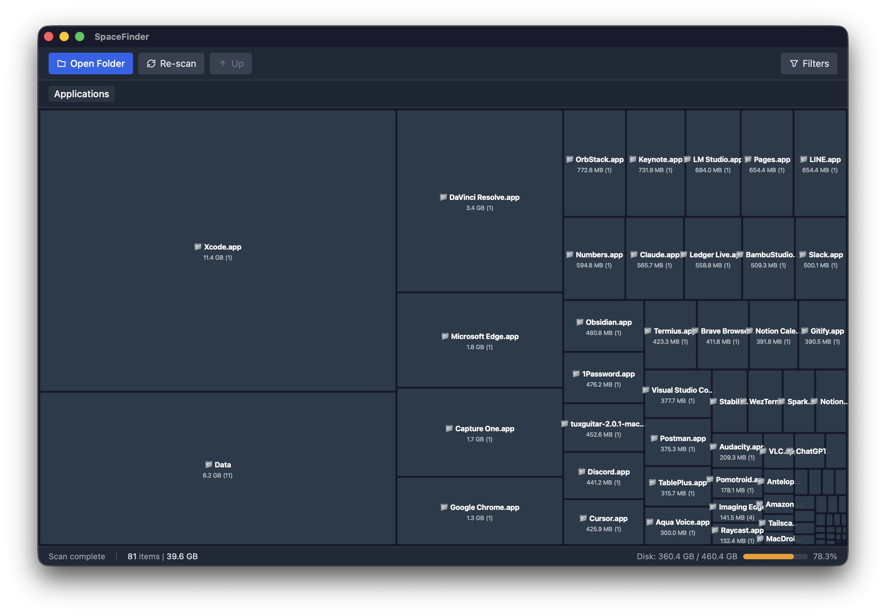

<p align="center">
  <h1 align="center">SpaceFinder</h1>
  <p align="center">
    A fast, visual disk usage analyzer built with Tauri + React
    <br />
    <a href="https://github.com/skmtkytr/spacefinder/releases/latest"><strong>Download Latest Release</strong></a>
  </p>
</p>

<p align="center">
  <a href="https://github.com/skmtkytr/spacefinder/releases/latest">
    
  </a>
  <a href="https://github.com/skmtkytr/spacefinder/blob/master/LICENSE">
    
  </a>
  <a href="https://github.com/skmtkytr/spacefinder/actions/workflows/release.yml">
    
  </a>
</p>

<p align="center">
  
</p>

---

## Features

- **Interactive Treemap** — Visualize disk usage as a treemap. Directories are shown as blocks proportional to their size. Click to drill down one level at a time.
- **Fast Scanning** — Powered by Rust and [jwalk](https://crates.io/crates/jwalk) for high-performance parallel directory traversal.
- **Filtering** — Filter by file name, minimum size, or file category (images, videos, code, etc.).
- **Context Menu** — Right-click any item to reveal in Finder, move to trash, or permanently delete.
- **Keyboard Shortcuts** — Navigate quickly without touching the mouse.
- **Cross-platform** — Available for macOS (Apple Silicon & Intel) and Windows.

## Keyboard Shortcuts

| Shortcut | Action |
|---|---|
| `Cmd/Ctrl + O` | Open folder |
| `Cmd/Ctrl + R` | Re-scan |
| `Cmd/Ctrl + F` | Toggle filters |
| `Backspace` / `Alt + Up` | Navigate up |
| `Home` | Jump to root |
| `Escape` | Close menu / filters |

## Installation

### Download

Grab the latest build from the [Releases](https://github.com/skmtkytr/spacefinder/releases/latest) page:

| Platform | File |
|---|---|
| macOS (Apple Silicon) | `SpaceFinder_x.x.x_aarch64.dmg` |
| macOS (Intel) | `SpaceFinder_x.x.x_x64.dmg` |
| Windows | `SpaceFinder_x.x.x_x64-setup.exe` / `.msi` |

> **macOS note:** The app is currently unsigned. After opening the `.dmg`, move the app to `/Applications`, then run:
> ```bash
> xattr -cr /Applications/SpaceFinder.app
> ```

### Build from Source

Prerequisites: [Node.js](https://nodejs.org/) 22+, [pnpm](https://pnpm.io/), [Rust](https://rustup.rs/)

```bash
git clone https://github.com/skmtkytr/spacefinder.git
cd spacefinder
pnpm install
pnpm tauri dev    # development
pnpm tauri build  # production build
```

## Tech Stack

| Layer | Technology |
|---|---|
| Framework | [Tauri 2](https://tauri.app/) |
| Frontend | React 19, TypeScript, Tailwind CSS |
| Visualization | [d3-hierarchy](https://d3js.org/d3-hierarchy) (treemap layout) |
| State | [Zustand](https://zustand.docs.pmnd.rs/) |
| Backend | Rust (jwalk, sysinfo, trash) |
| Build | Vite, GitHub Actions |

## License

[MIT](LICENSE)
